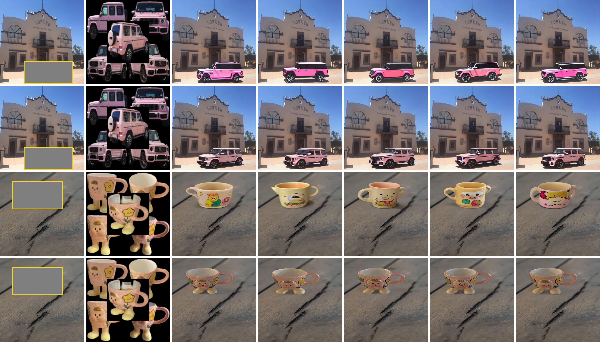

# MureObjectStitch-Image-Composition

MureObjectStitch is a simple extension of [ObjectStitch](https://github.com/bcmi/ObjectStitch-Image-Composition) to support multiple reference images of foreground object. Generally speaking, more reference images lead to better results. 

You can also finetune MureObjectStitch using a few images of the foreground object for better detail preservation. 


MureObjectStitch has been integrated into our image composition toolbox [libcom](https://github.com/bcmi/libcom).

## Get Started

### 1.  Dependencies

  - torch==1.11.0
  - pytorch_lightning==1.8.1
  - install dependencies:
    ```bash
    cd ObjectStitch-Image-Composition
    pip install -r requirements.txt
    cd src/taming-transformers
    pip install -e .
    ```

### 2.  Download Models

  - Please download the following files to the ``checkpoints`` folder to create the following file tree:
    ```bash
    checkpoints/
    ├── ObjectStitch.pth
    └── openai-clip-vit-large-patch14
        ├── config.json
        ├── merges.txt
        ├── preprocessor_config.json
        ├── pytorch_model.bin
        ├── tokenizer_config.json
        ├── tokenizer.json
        └── vocab.json
    ```
  - **openai-clip-vit-large-patch14 ([Huggingface](https://huggingface.co/BCMIZB/Libcom_pretrained_models/blob/main/openai-clip-vit-large-patch14.zip) | [ModelScope](https://www.modelscope.cn/models/bcmizb/Libcom_pretrained_models/file/view/master/openai-clip-vit-large-patch14.zip))**.

  - **ObjectStitch.pth ([Huggingface](https://huggingface.co/BCMIZB/Libcom_pretrained_models/blob/main/ObjectStitch.pth) | [ModelScope](https://www.modelscope.cn/models/bcmizb/Libcom_pretrained_models/file/view/master/ObjectStitch.pth))**.
  
### 3. Finetune on examples
- Please prepare your training data following the examples in `open_images.py`
- To finetune objectstitch, you can use `main.py`.For example,
  ```py
  python main.py \
    --logdir experiments/objectstitch \
    --name='car_multifg' \
    --num_workers 4 \
    --devices 1 \
    --batch_size 1 \
    --num_nodes 1 \
    --base configs/murecom.yaml \
    --package_name='Car' \
  ```
    or simply run:
    ```
    sh test.sh
    ```
### 4. Inference on examples
- Please refer to the [examples](./examples/) folder for data preparation:
  - keep the same filenames for each pair of data. 
  - either the ``mask_bbox`` folder or the ``bbox`` folder is sufficient.
- To perform image composition using our model or your model , you can use `scripts/inference.py`. For example,

    ```
    python scripts/inference.py \
    --outdir results \
    --testdir examples \
    --num_samples 5 \
    --sample_steps 50 \
    --gpu 0
    ```
    or simply run:
    ```
    sh test.sh
    ```
    These images under ``examples`` folder are obtained from [Murecom](https://github.com/bcmi/DreamCom-Image-Composition) dataset. You can place your own images in the `examples` directory.
### 5. Visualization Results
We showcase several results generated by the released model and the model after finetuning on Murecom dataset. In each example, we display the background image with a bounding box (yellow), the foreground image, and 5 randomly sampled images. The first and third lines are test results of the original model, and the second and fourth lines are test results after fine-tuning the model.
<p align='center'>  
  
</p>