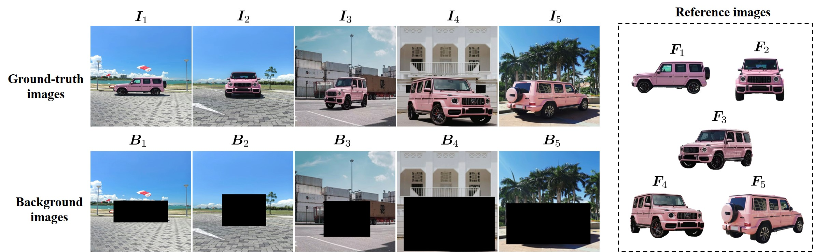
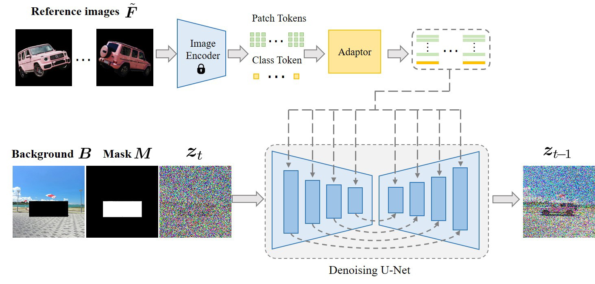
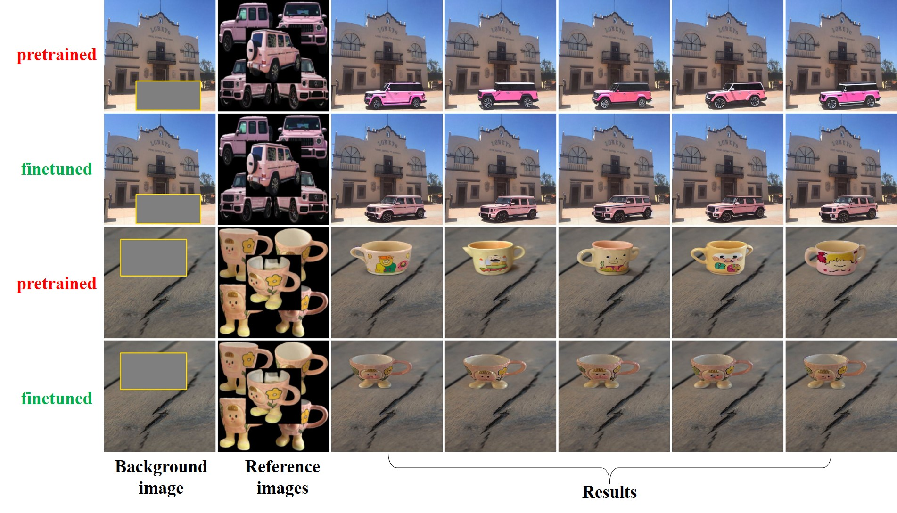

# MureObjectStitch-Image-Composition

This is the technical report for MureObjectStitch, which has been integrated into our image composition toolbox [libcom](https://github.com/bcmi/libcom).
> **MureObjectStitch: Multi-reference Image Composition**  [[arXiv]](https://arxiv.org/pdf/2411.07462) <br>

MureObjectStitch is a simple extension of [ObjectStitch](https://github.com/bcmi/ObjectStitch-Image-Composition) to support multiple reference images of one foreground object. Generally, more reference images could lead to better results. 

We release the pretrained model for MureObjectStitch, which can achieve good results for common or simple objects. However, the pretrained model is weak in keeping the object identity for the objects with rich details. If you have a few images containing the foreground object, we suggest finetuning MureObjectStitch using these images, which can greatly promote the detail preservation. 

**Note that in the reference images, the foreground object's length and width should fully extend to the edges of the image (see our example), otherwise the performance would be severely affected.**

<p align='center'>  
  
  
</p>

## Get Started

### 1.  Dependencies

  - torch==1.11.0
  - pytorch_lightning==1.8.1
  - install dependencies:
    ```bash
    cd ObjectStitch-Image-Composition
    pip install -r requirements.txt
    cd src/taming-transformers
    pip install -e .
    ```

### 2.  Download the Pretrained Models

  - Please download the following files to the ``checkpoints`` folder to create the following file tree:
    ```bash
    checkpoints/
    ├── ObjectStitch.pth
    └── openai-clip-vit-large-patch14
        ├── config.json
        ├── merges.txt
        ├── preprocessor_config.json
        ├── pytorch_model.bin
        ├── tokenizer_config.json
        ├── tokenizer.json
        └── vocab.json
    ```
  - **openai-clip-vit-large-patch14 ([Huggingface](https://huggingface.co/BCMIZB/Libcom_pretrained_models/blob/main/openai-clip-vit-large-patch14.zip) | [ModelScope](https://www.modelscope.cn/models/bcmizb/Libcom_pretrained_models/file/view/master/openai-clip-vit-large-patch14.zip))**.

  - **ObjectStitch.pth ([Huggingface](https://huggingface.co/BCMIZB/Libcom_pretrained_models/blob/main/ObjectStitch.pth) | [ModelScope](https://www.modelscope.cn/models/bcmizb/Libcom_pretrained_models/file/view/master/ObjectStitch.pth))**.
  
### 3. Finetune on Examples
- Please prepare your training data following the examples in `finetuning_examples`
- You can use `MureComDataset` in `ldm/data/open_images.py` to load your data. 
- To finetune objectstitch, you can use `main.py`. For example,
  
  ```py
  python main.py \
    --logdir experiments/objectstitch \
    --name='car_multifg' \
    --num_workers 4 \
    --devices 1 \
    --batch_size 1 \
    --num_nodes 1 \
    --base configs/murecom.yaml \
    --package_name='Car' \
    --fg_name='fg1' \
  ```
    or simply run:
    ```
    sh finetune.sh
    ```
- We finetune the model for 150 epochs by default. You can modify the training settings in `configs/murecom.yaml`. After finetuning, the checkpoints are saved in `logdir`. You can change the path of the checkpoints by modifying this argument.
### 4. Inference on Examples
- Please refer to the [examples](./examples/) folder for data preparation:
  - Use the same filename for paired data (e.g., `background` and `bbox`, `foreground` and `foreground_mask`). 
- To perform image composition using the pretrained model or your finetuned model, you can use `scripts/inference.py`. For example,

    ```
    python scripts/inference.py \
    --outdir results \
    --testdir examples/example1 \
    --num_samples 5 \
    --sample_steps 50 \
    --gpu 0
    ```
    or simply run:
    ```
    sh test.sh
    ```
    The images in the ``examples`` folder are collected from [Murecom](https://github.com/bcmi/DreamCom-Image-Composition) dataset. You can place your own images in the ``examples`` folder. If you want to use your own checkpoints, you need to set `ckpt_dir`.
  
### 5. Visualization Results
We showcase several example results generated by the pretrained model and the finetuned model on Murecom dataset. In each example, from left to right, we show the background image with bounding box to insert the foreground object, the reference images of foreground image, and 5 results using different random seeds. The results in odd rows are obtained using the pretrained model, and the results in even rows are obtained using the finetuned model. 

<p align='center'>  
  
</p>

We also provide more results of our MureObjectStitch on Murecom dataset through [[Baidu Cloud]](https://pan.baidu.com/s/1QK6IfwnxdVnSWs5lOd0HuA?pwd=7jxd) (code: 7jxd). In each image in the folder, from top to bottom, we show the results using the model finetuned for 50, 100, 150, 200 epochs. Finetuning 150 epochs can generally achieve satisfactory results. In some cases, finetuning more epochs (e.g., 200 epochs) is helpful for keeping more details, yet at the risk of distorted content and improper illumination. Finetuning 150 epochs takes about 15 minutes on a single A6000 GPU card. 

In the figure below, we show some example results of our MureObjectStitch. In each example, from left to right, we show the background image with specified foreground placement, one example reference image of foreground object, and 5 results using different random seeds.

<p align='center'>  
  
</p>


## Citation
If you find this work or code is helpful in your research, please cite:
````
@article{mureobjectstitch,
  title={MureObjectStitch: Multi-reference Image Composition},
  author={Chen, Jiaxuan and Zhang, Bo and Niu, Li},
  journal={arXiv preprint arXiv:2411.07462},
  year={2024}
}
````

## Other Resources
+ We summarize the papers and codes of generative image composition: [Awesome-Generative-Image-Composition](https://github.com/bcmi/Awesome-Generative-Image-Composition)
+ We summarize the papers and codes of image composition from all aspects: [Awesome-Image-Composition](https://github.com/bcmi/Awesome-Object-Insertion)
+ We summarize all possible evaluation metrics to evaluate the quality of composite images:  [Composite-Image-Evaluation](https://github.com/bcmi/Composite-Image-Evaluation)
+ We write a comprehensive survey on image composition: [the latest version](https://arxiv.org/pdf/2106.14490.pdf)

